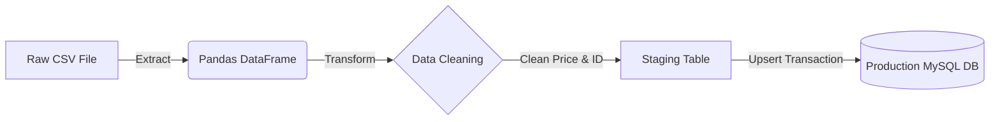

# 🚀 Automated Product Data Pipeline (ETL)


## 📖 Overview
This project is an automated **ETL (Extract, Transform, Load) Data Pipeline** built with Python. It is designed to solve the problem of manual data entry errors and inconsistency.

The system automatically extracts product data from raw CSV files, cleans and validates the data, and loads it into a **MySQL Database** using an **Upsert strategy** (Update if exists, Insert if new). This ensures data integrity and prevents duplication.

## 🏗️ Architecture
The pipeline follows a strict modular ETL design:


<ol> 
  <li><b>Extract: </b> Reads raw data from mermaid `data/raw/products.csv`</li>
  <li><b>Transform:</b>
    <ul>
    <li> Cleans currency formatting.</li>
    <li> Standardizes data types.</li>
    <li> Deduplicates records based on id.</li>
    </ul>
  </li>
  <li><b>Load:</b> safely loads data into MySQL using SQLAlchemy and a Staging Table approach to ensure
  <b>Idempotency</b>(can be run multiple times without errors)</li>
  <li><b>Automation:</b> Uses a Python-based scheduler to run the pipeline daily at 08.00 AM.</li>
</ol>

## 🛠️ Tech Stack
<ol>
  <li>Language: Python 3.x</li>
  <li>Data Processing: Pandas</li>
  <li>Database: MySQL 8.0</li>
  <li>ORM & Connections: SQLAlchemy, PyMySQL</li>
  <li>Configuration: python-dontenv</li>
  <li>Scheduling: Schedule Library</li>
</ol>

## 📂 Project Structure

```text
data_pipeline_project/
├── data/
│   ├── raw/                # Input CSV files
│   └── processed/          # Archived files (optional)
├── logs/                   # System execution logs
├── src/
│   ├── __init__.py
│   ├── config.py           # Configuration management
│   ├── extract.py          # Data extraction logic
│   ├── transform.py        # Data cleaning & transformation logic
│   ├── load.py             # Database loading logic (Upsert)
│   ├── main.py             # Pipeline orchestrator
│   └── scheduler.py        # Automation script
├── .env.example            # Environment variables template
├── .gitignore              # Git ignore rules
├── requirements.txt        # Python dependencies
└── README.md               # Project documentation
```

## ⚙️ Setup & Installation
**1. Clone the repository**
```text
git clone [https://github.com/](https://github.com/)[khanglm845]/automatic-product-etl-pipeline.git
cd automatic-product-etl-pipeline
```
**2. Set up Virtual Enviroment**
```text
# Windows
python -m venv .venv
.venv\Scripts\activate

# Mac/Linux
python3 -m venv .venv
source .venv/bin/activate
```
**3. Install Dependencies**
```text
pip install -r requirements.txt
```
**4. Database Configuration**
Create a file named `.env` in the root directory (based on `.env.example`) and add your MySQL credentials:
```text
DB_USER=root
DB_PASSWORD=your_password
DB_HOST=localhost
DB_NAME=my_data_project
```
**5. Initialize Database**
Run the following SQL script in MySQL Workbench to create the necessary table:
```text
CREATE DATABASE IF NOT EXISTS my_data_project;
USE my_data_project;

CREATE TABLE IF NOT EXISTS products (
    id INT PRIMARY KEY,
    product_name VARCHAR(255),
    price FLOAT,
    category VARCHAR(100),
    last_updated TIMESTAMP DEFAULT CURRENT_TIMESTAMP ON UPDATE CURRENT_TIMESTAMP
);
```
## 🚀 Usage
**Option 1: Run Manually (One-time)**
To trigger the ETL pipeline immediately:
`python -m src.main`

**Option 2: Run Scheduler (Automation)**
To start the scheduler (default: runs daily or every 30s for testing):
`python -m src.scheduler`

## 🛡️ Key Features & Highlights
+ **Idempotency:** The pipeline utilizes an `ON DUPLICATE KEY UPDATE` strategy. Running the pipeline
multiple times will NOT create duplicate rows.
+ **Security:** Database credentials are never hardcoded, managed via environment variables.
+ **Error Handling:** Comprehensive `try-except` blocks and logging system to track pipleline health.
+ **Data Quality:** Automatically handles missing values (`NaN`) and corrects invalid data types before loading.
  
